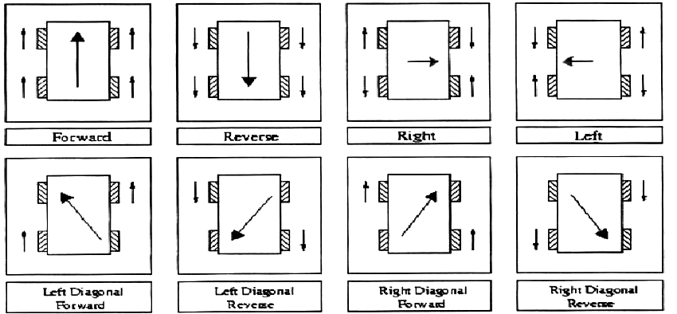

# Mecanum drive example code
This repository contains the code from the code we went over today.
It should be pretty well commented and pretty self-explanatory.  If you
don't remember how the speeds of each wheel are calculated, you can
refer to the diagram below.

For reference, remember that we calculate the speeds with these formulas:

| Wheels         |      Speeds    |
| :-------------: | :-------------: |
| Front left     | `drive + strafe + twist`       |
| Front right    | `drive - strafe - twist`       |
| Back left      | `drive - strafe + twist`       |
| Back right     | `drive + strafe - twist`       |

If something still doesn't make sense, don't be afraid to send me
an email or open an issue on this repository.
You're not dumb, I just need to explain it better.
